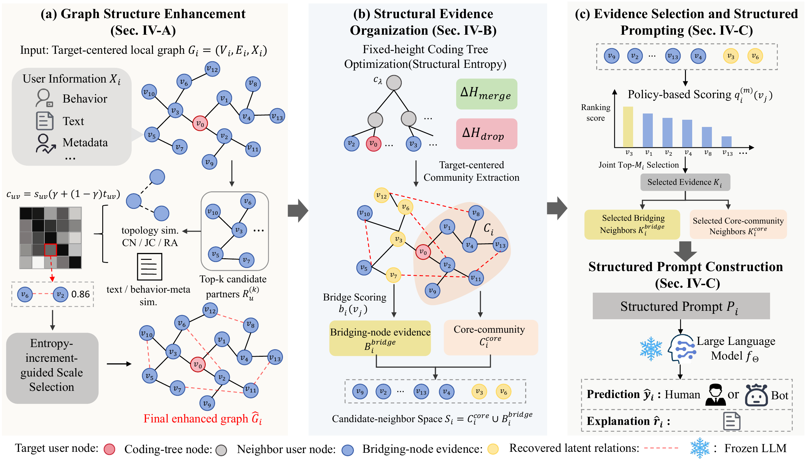

<div align="center">

# GEBot

### Graph Evidence for Large Language Model-based Social Bot Detection

Official implementation of a training-free framework for converting local
social graphs into compact structural evidence for frozen LLMs.

[](https://www.python.org/)
[](#release-status)
[](LICENSE)

[Method](#method-overview) | [Installation](#installation) |
[Data](#data) | [Experiments](#experiments) | [Citation](#citation)

</div>

## Overview

GEBot addresses LLM-based social bot detection without task-specific model
training. Instead of serializing a large, noisy neighborhood directly into a
prompt, it recovers plausible graph relations, organizes complementary
structural roles, and selects representative evidence under a limited context
budget. The resulting prompt is sent to a frozen LLM for human-or-bot
classification.

The implementation supports TwiBot-22 and BotSim-24, component and feature
ablations, sensitivity and ranking-policy analyses, and matched Random,
Attention, MRT, and CISC prompt baselines.

## Method overview



GEBot contains three stages:

1. **Graph Structure Enhancement (WGSE)** recovers a controlled set of latent
   relations from user-level and local-topological similarities.
2. **Structural Evidence Organization (SE-HCI)** uses structural entropy to
   separate core-community and bridging-node evidence.
3. **Evidence Selection and Structured Prompting (PRKNS)** ranks representative
   neighbors and constructs a compact prompt for frozen-LLM inference.

## Installation

The code requires Python 3.9 or newer. Because this repository is currently
all-rights-reserved, installation and execution require permission from the
copyright holders; see [LICENSE](LICENSE).

```bash
git clone https://github.com/anywaylike/GEBot.git
cd GEBot
python -m venv .venv
```

Activate the environment and install the package:

```bash
# macOS/Linux
source .venv/bin/activate

# Windows PowerShell
# .\.venv\Scripts\Activate.ps1

python -m pip install --upgrade pip
pip install -e .
```

For development and testing, install `pip install -e ".[dev]"` instead.

## Data

Datasets and the balanced 1,000-user cohorts used in the experiments are not
distributed in this repository. Obtain authorized copies from the official
sources and prepare them locally:

| Dataset | Official source | Expected local test file |
| --- | --- | --- |
| TwiBot-22 | [LuoUndergradXJTU/TwiBot-22](https://github.com/LuoUndergradXJTU/TwiBot-22) | `data/Twibot-22/community_format/test.json` |
| BotSim-24 | [QQQQQQBY/BotSim](https://github.com/QQQQQQBY/BotSim) ([dataset instructions](https://github.com/QQQQQQBY/BotSim/blob/main/BotSim-24-Dataset/Readme.md)) | `data/BotSim-24/processed/train.json` and `test.json` |

See [data/README.md](data/README.md) for the local layout and privacy contract.
The exact paper cohorts, selected account IDs, processed user records, prompts,
and cached LLM responses remain private and are excluded from Git. After
preparing authorized local copies, you can generate a deterministic alternative
cohort (seed 2026) without publishing its records:

```bash
python -m graphreason_bot.prepare_cohort --dataset all
```

## Configuration

Copy the environment template and fill in only the provider settings you use:

```bash
# macOS/Linux
cp .env.example .env

# Windows PowerShell
# Copy-Item .env.example .env
```

Never commit `.env` or place credentials in source files, commands, issues, or
logs. Dataset and output locations can be overridden with
`GRAPHREASON_DATA_ROOT` and `GRAPHREASON_RESULTS_DIR`.

Check that the configured files exist and contain both labels without calling
an LLM. This is a shallow count check, not full schema validation:

```bash
python -m graphreason_bot.evaluation --dataset all --validate_only
```

## Experiments

### Public fixed-test run

```bash
python -m graphreason_bot.evaluation \
  --dataset all --data_source fixed_test --model_name gpt-4o-mini \
  --sampling_mode balanced --n_per_class 500 \
  --neighbor_ratio 0.6 --prkns_method followers \
  --run_tag main --result_dir outputs/main
```

`--n_per_class` is an upper bound: the evaluator caps both classes to the
smaller available class. In the standard BotSim-24 8:2 test split, this means
200 bots and 200 humans, not the paper's private 500/500 cohort. Set the
matching provider endpoint and model identifier in `.env` before a real LLM
run.

### Paper-cohort run

Authorized maintainers with local `selected_1000.json` files can run the exact
1,000-record pathway without committing those files:

```bash
python -m graphreason_bot.evaluation \
  --dataset all --data_source selected_1000 --model_name gpt-4o-mini \
  --sampling_mode balanced --n_per_class 500 \
  --neighbor_ratio 0.6 --prkns_method followers \
  --run_tag paper_cohort --result_dir outputs/paper_cohort
```

Public users can create a deterministic alternative cohort with
`graphreason_bot.prepare_cohort`, but it is not guaranteed to be byte-identical
to the unpublished paper cohort because preprocessing revisions may differ.

### Ablations and baselines

```bash
# Component and feature ablations
python -m graphreason_bot.evaluation --dataset all --run_ablations
python -m graphreason_bot.evaluation --dataset all --run_feature_ablations

# Inspect baseline interfaces before running provider-backed evaluation
python -m graphreason_bot.baselines.random_twibot22 --help
python -m graphreason_bot.baselines.attention_botsim24 --help
python -m graphreason_bot.baselines.mrt --help
python -m graphreason_bot.baselines.cisc --help
```

For the experiment matrix, fixed hyperparameters, sensitivity commands, source
limitations, and output conventions, see [docs/EXPERIMENTS.md](docs/EXPERIMENTS.md).

## Repository structure

```text
GEBot/
├── assets/                         # README figures
├── data/README.md                 # Data sources and local layout
├── docs/
│   ├── EXPERIMENTS.md              # Commands by experiment family
│   └── REPOSITORY_SCOPE.md         # Included/excluded artifacts
├── src/graphreason_bot/
│   ├── evaluation.py               # Unified evaluation entry point
│   ├── wgse.py, se_hci.py, prkns.py # Core GEBot stages
│   ├── prompt.py, llm.py, metrics.py
│   ├── prepare_cohort.py          # Local deterministic sampler
│   └── baselines/                  # Matched prompt baselines
├── tests/                           # Core regression tests
├── .env.example
└── pyproject.toml
```

Generated results are written under `outputs/` and are intentionally ignored
by Git.

## Reproducibility checklist

For every reported run, record the dataset release and preprocessing revision,
cohort seed, provider and model identifier, command-line arguments, upstream
baseline commit, and output directory. Run the local checks before submitting a
change:

```bash
pytest -q
python -m graphreason_bot.evaluation --help
```

## Citation

If this repository is useful in your research, please cite:

```bibtex
@misc{xie2026gebot,
  title  = {GEBot: Graph Evidence for Large Language Model-based Social Bot Detection},
  author = {Xie, Yuetao and Jiang, Shengyue and Xu, Xiao-Ke},
  year   = {2026},
  note   = {Manuscript},
  url    = {https://github.com/anywaylike/GEBot}
}
```

GitHub-compatible citation metadata is also provided in [CITATION.cff](CITATION.cff).
The citation will be updated when the publication record becomes available.

## Contributing and contact

Bug reports, documentation corrections, and reproducibility questions are
welcome through
[GitHub Issues](https://github.com/anywaylike/GEBot/issues). Please read
[CONTRIBUTING.md](CONTRIBUTING.md) and do not attach datasets, account IDs,
credentials, prompts containing user records, or private experiment outputs.

## Release status

This is a public research-code repository. Public visibility does not grant an
open-source license: the code remains all-rights-reserved unless the copyright
holders add an explicit license. See [LICENSE](LICENSE), [SECURITY.md](SECURITY.md),
and [docs/REPOSITORY_SCOPE.md](docs/REPOSITORY_SCOPE.md) before reuse or redistribution.
